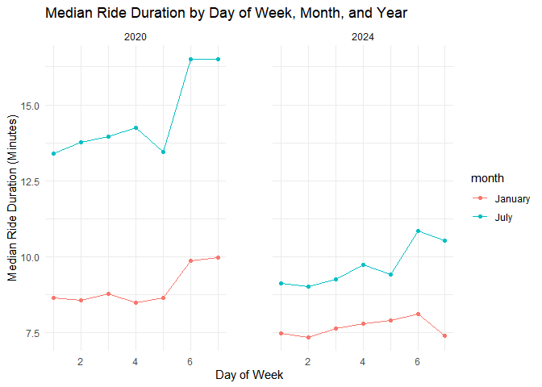
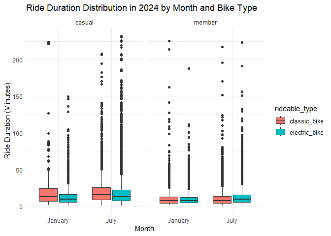

p8105_hw3_yy3564
================
Yonghao YU
2024-10-15

# Problem 2

``` r
library(tidyverse)
```

### First, I load, tidy, merge, and organize the datasets. My final dataset includes all originally observed variables; excludes participants less than 21 years of age, and those with missing demographic data; and encode data with reasonable variable classes

``` r
demographic = 
  read_csv("data/nhanes_covar.csv", skip = 4, na = c("NA","",".")) |>
  janitor::clean_names() |>
  drop_na(sex:education) |>
  filter(age>21) |>
  mutate(education = factor(education, levels = c("1", "2", "3"), labels = c("Less than high school", "High school equivalent", "More than high school"), ordered = TRUE)) |>
  mutate(sex = factor(sex, levels=c("1", "2"), labels = c("male", "female"), ordered = TRUE))
```

    ## Rows: 250 Columns: 5
    ## ── Column specification ────────────────────────────────────────────────────────
    ## Delimiter: ","
    ## dbl (5): SEQN, sex, age, BMI, education
    ## 
    ## ℹ Use `spec()` to retrieve the full column specification for this data.
    ## ℹ Specify the column types or set `show_col_types = FALSE` to quiet this message.

``` r
demographic
```

    ## # A tibble: 225 × 5
    ##     seqn sex      age   bmi education             
    ##    <dbl> <ord>  <dbl> <dbl> <ord>                 
    ##  1 62161 male      22  23.3 High school equivalent
    ##  2 62164 female    44  23.2 More than high school 
    ##  3 62174 male      80  33.9 More than high school 
    ##  4 62177 male      51  20.1 High school equivalent
    ##  5 62178 male      80  28.5 High school equivalent
    ##  6 62180 male      35  27.9 More than high school 
    ##  7 62184 male      26  22.1 High school equivalent
    ##  8 62189 female    30  22.4 More than high school 
    ##  9 62199 male      57  28   More than high school 
    ## 10 62202 male      36  24.7 Less than high school 
    ## # ℹ 215 more rows

``` r
accelerometer = 
  read_csv("data/nhanes_accel.csv", na = c("NA","",".")) |>
  janitor::clean_names() |>
  drop_na()|>
  pivot_longer(min1:min1440, names_to = "minute", values_to = "mims_value")
```

    ## Rows: 250 Columns: 1441
    ## ── Column specification ────────────────────────────────────────────────────────
    ## Delimiter: ","
    ## dbl (1441): SEQN, min1, min2, min3, min4, min5, min6, min7, min8, min9, min1...
    ## 
    ## ℹ Use `spec()` to retrieve the full column specification for this data.
    ## ℹ Specify the column types or set `show_col_types = FALSE` to quiet this message.

``` r
accelerometer
```

    ## # A tibble: 360,000 × 3
    ##     seqn minute mims_value
    ##    <dbl> <chr>       <dbl>
    ##  1 62161 min1        1.11 
    ##  2 62161 min2        3.12 
    ##  3 62161 min3        1.47 
    ##  4 62161 min4        0.938
    ##  5 62161 min5        1.60 
    ##  6 62161 min6        0.145
    ##  7 62161 min7        2.10 
    ##  8 62161 min8        0.509
    ##  9 62161 min9        1.63 
    ## 10 62161 min10       1.20 
    ## # ℹ 359,990 more rows

``` r
final_df = full_join(demographic,accelerometer) |>
  drop_na() |>
  mutate(minute = str_remove(minute, "[^0-9]+"))
```

    ## Joining with `by = join_by(seqn)`

``` r
final_df
```

    ## # A tibble: 324,000 × 7
    ##     seqn sex     age   bmi education              minute mims_value
    ##    <dbl> <ord> <dbl> <dbl> <ord>                  <chr>       <dbl>
    ##  1 62161 male     22  23.3 High school equivalent 1           1.11 
    ##  2 62161 male     22  23.3 High school equivalent 2           3.12 
    ##  3 62161 male     22  23.3 High school equivalent 3           1.47 
    ##  4 62161 male     22  23.3 High school equivalent 4           0.938
    ##  5 62161 male     22  23.3 High school equivalent 5           1.60 
    ##  6 62161 male     22  23.3 High school equivalent 6           0.145
    ##  7 62161 male     22  23.3 High school equivalent 7           2.10 
    ##  8 62161 male     22  23.3 High school equivalent 8           0.509
    ##  9 62161 male     22  23.3 High school equivalent 9           1.63 
    ## 10 62161 male     22  23.3 High school equivalent 10          1.20 
    ## # ℹ 323,990 more rows

### Then I produce a reader-friendly table for the number of men and women in each education category

``` r
demographic |>
  group_by(sex,education) |>
  summarise(num_obs=n())
```

    ## `summarise()` has grouped output by 'sex'. You can override using the `.groups`
    ## argument.

    ## # A tibble: 6 × 3
    ## # Groups:   sex [2]
    ##   sex    education              num_obs
    ##   <ord>  <ord>                    <int>
    ## 1 male   Less than high school       27
    ## 2 male   High school equivalent      34
    ## 3 male   More than high school       54
    ## 4 female Less than high school       28
    ## 5 female High school equivalent      23
    ## 6 female More than high school       59

### After that, I create a visualization of the age distributions for men and women in each education category.

``` r
ggplot(demographic,aes(x = education, y = age)) +
  geom_violin(aes(fill = sex), alpha = 0.5) +
  labs(title = "Age Distributions by Sex and Education Level",
       x = "Education Level",
       y = "Age")
```

<!-- -->

### Some comments for this visualization:

This violin plot shows age distributions by education level and sex. The
width of each violin indicates the density of individuals at different
ages. For “Less than high school,” male and female distributions are
fairly balanced, while “More than high school” shows a wider spread,
especially for females. The plot highlights differences in age
concentration across education levels, with “More than high school”
having the broadest age range. The color contrast between males (purple)
and females (yellow) is clear.

### Then I use my tidied dataset, and aggregate across minutes to create a total activity variable for each participant.

``` r
activity_df = final_df |>
  group_by(sex,minute,education,age) |>
  summarise(total_value = sum(mims_value, na.rm = TRUE))
```

    ## `summarise()` has grouped output by 'sex', 'minute', 'education'. You can
    ## override using the `.groups` argument.

``` r
activity_df
```

    ## # A tibble: 218,880 × 5
    ## # Groups:   sex, minute, education [8,640]
    ##    sex   minute education               age total_value
    ##    <ord> <chr>  <ord>                 <dbl>       <dbl>
    ##  1 male  1      Less than high school    23        4.01
    ##  2 male  1      Less than high school    29       12.4 
    ##  3 male  1      Less than high school    31        8.58
    ##  4 male  1      Less than high school    36        3.68
    ##  5 male  1      Less than high school    39        6.32
    ##  6 male  1      Less than high school    44        1.54
    ##  7 male  1      Less than high school    45        8.39
    ##  8 male  1      Less than high school    46        5.05
    ##  9 male  1      Less than high school    47        1.83
    ## 10 male  1      Less than high school    48        2.85
    ## # ℹ 218,870 more rows

### Then I plot these total activities (y-axis) against age (x-axis) to compare men to women who have separate panels for each education level. After that I include a trend line or a smooth to illustrate differences.

``` r
ggplot(activity_df, aes(x = age, y = total_value, color = sex)) +
  geom_point(alpha = 0.5) +  
  geom_smooth(method = "loess", se = FALSE) + 
  facet_grid(~ education) + 
  labs(title = "Total Activity vs Age by Gender and Education Level",
       x = "Age",
       y = "Total Activity",
       color = "Sex") +  
  theme_minimal() 
```

    ## `geom_smooth()` using formula = 'y ~ x'

<!-- -->

### Then I make some comments for this plot:

This scatter plot shows total activity by age, gender, and education
level. Males (purple) generally show higher activity levels than females
(yellow), especially after age 40. The “More than high school” group has
the widest activity range, with many high-activity outliers,
particularly in older age groups. In contrast, the “Less than high
school” and “High school equivalent” groups have more consistent and
lower activity levels. The trend lines indicate that activity declines
with age, though some individuals, especially with higher education,
maintain higher activity levels in older age brackets. This
visualization effectively highlights these patterns.

### Then I create a dataframe split the time into hour based as following!

``` r
activity_df2 = final_df |>
  mutate(minute = as.numeric(minute)) |>
  mutate(hour = floor((minute - 1) / 60) + 1) |>
  group_by(education,sex, hour)|>
  summarise(total_value = sum(mims_value, na.rm = TRUE))
```

    ## `summarise()` has grouped output by 'education', 'sex'. You can override using
    ## the `.groups` argument.

``` r
activity_df2
```

    ## # A tibble: 144 × 4
    ## # Groups:   education, sex [6]
    ##    education             sex    hour total_value
    ##    <ord>                 <ord> <dbl>       <dbl>
    ##  1 Less than high school male      1       6956.
    ##  2 Less than high school male      2       5594.
    ##  3 Less than high school male      3       3983.
    ##  4 Less than high school male      4       3356.
    ##  5 Less than high school male      5       3136.
    ##  6 Less than high school male      6       6521.
    ##  7 Less than high school male      7       9447.
    ##  8 Less than high school male      8      15540.
    ##  9 Less than high school male      9      20455.
    ## 10 Less than high school male     10      21702.
    ## # ℹ 134 more rows

### After that I make a three-panel plot that shows the 24-hour activity time courses for each education level and use color to indicate sex.

``` r
ggplot(activity_df2, aes(x = hour, y = total_value, color = sex)) +
  geom_point(alpha = .4) +
  geom_smooth(method = "loess", se = FALSE) + 
  facet_grid(~ education) +  
  labs(title = "24-Hour Activity Time Course by Education Level",
       x = "Time of Day (in hour)",
       y = "Mean Activity",
       color = "sex") +  
  theme_minimal() + 
  theme(panel.spacing = unit(2, "lines"))
```

    ## `geom_smooth()` using formula = 'y ~ x'

<!-- -->

### Then I make some comments for this plot:

This scatter and line plot shows the 24-hour activity patterns by
education level and sex. Both males (purple) and females (yellow)
exhibit similar daily activity curves, peaking around 10-12 hours
(midday). In all education groups, females consistently have higher mean
activity levels, particularly in the “More than high school” group,
where the difference is most pronounced. The “Less than high school”
group has the lowest overall activity levels, while “More than high
school” shows the highest. Activity starts low in the early hours,
increases sharply until midday, and declines after. This plot
effectively highlights the impact of education on daily activity
patterns.

# Problem 3

### First, I import, clean, and tidy these data, and describe the resulting dataset.

``` r
Jan20 = 
  read_csv("data/Jan 2020 Citi.csv", na = c("NA","",".")) |>
  janitor::clean_names() |>
  mutate(year = 2020, month = "January")
```

    ## Rows: 12420 Columns: 7
    ## ── Column specification ────────────────────────────────────────────────────────
    ## Delimiter: ","
    ## chr (6): ride_id, rideable_type, weekdays, start_station_name, end_station_n...
    ## dbl (1): duration
    ## 
    ## ℹ Use `spec()` to retrieve the full column specification for this data.
    ## ℹ Specify the column types or set `show_col_types = FALSE` to quiet this message.

``` r
Jan20
```

    ## # A tibble: 12,420 × 9
    ##    ride_id   rideable_type weekdays duration start_station_name end_station_name
    ##    <chr>     <chr>         <chr>       <dbl> <chr>              <chr>           
    ##  1 4BE06CB3… classic_bike  Tuesday     15.3  Columbus Ave & W … E 53 St & Madis…
    ##  2 26886E03… classic_bike  Wednesd…     5.31 2 Ave & E 96 St    1 Ave & E 110 St
    ##  3 24DC5606… classic_bike  Friday       9.69 Columbia St & Riv… Grand St & Eliz…
    ##  4 EEDC1053… classic_bike  Sunday       7.00 W 84 St & Columbu… Columbus Ave & …
    ##  5 2CD4BD4C… classic_bike  Friday       2.85 Forsyth St & Broo… Suffolk St & St…
    ##  6 E18682F9… classic_bike  Sunday      25.5  Allen St & Hester… Atlantic Ave & …
    ##  7 B9B2E896… classic_bike  Sunday       3.65 Lafayette St & Je… Washington Pl &…
    ##  8 DEF8F504… classic_bike  Sunday      38.3  28 Ave & 44 St     Broadway & Kosc…
    ##  9 17D44DA9… classic_bike  Thursday    38.5  Barrow St & Hudso… Emerson Pl & My…
    ## 10 0FD113A3… classic_bike  Tuesday      6.52 Carlton Ave & Par… Emerson Pl & My…
    ## # ℹ 12,410 more rows
    ## # ℹ 3 more variables: member_casual <chr>, year <dbl>, month <chr>

``` r
July20 = 
  read_csv("data/July 2020 Citi.csv", na = c("NA","",".")) |>
  janitor::clean_names() |>
  mutate(year = 2020, month = "July")
```

    ## Rows: 21048 Columns: 7
    ## ── Column specification ────────────────────────────────────────────────────────
    ## Delimiter: ","
    ## chr (6): ride_id, rideable_type, weekdays, start_station_name, end_station_n...
    ## dbl (1): duration
    ## 
    ## ℹ Use `spec()` to retrieve the full column specification for this data.
    ## ℹ Specify the column types or set `show_col_types = FALSE` to quiet this message.

``` r
July20
```

    ## # A tibble: 21,048 × 9
    ##    ride_id   rideable_type weekdays duration start_station_name end_station_name
    ##    <chr>     <chr>         <chr>       <dbl> <chr>              <chr>           
    ##  1 A7503F19… classic_bike  Sunday       9.86 Franklin Ave & Em… Grand Army Plaz…
    ##  2 B47EBE0E… classic_bike  Monday       8.29 E 33 St & 1 Ave    E 33 St & 5 Ave 
    ##  3 8146F6C6… classic_bike  Wednesd…     5.39 George St & Wilso… Willoughby Ave …
    ##  4 D49560E3… classic_bike  Saturday    19.2  St. Nicholas Ave … Willis Ave & E …
    ##  5 87687AAE… classic_bike  Tuesday     26.4  Front St & Jay St  Grand St & Eliz…
    ##  6 E30DFCD9… classic_bike  Sunday      51.9  Clinton St & Jora… Myrtle Ave & Li…
    ##  7 0C53CC46… classic_bike  Tuesday     15.7  Vernon Blvd & 50 … Vernon Blvd & 3…
    ##  8 34B02685… classic_bike  Wednesd…     8.39 11 Ave & W 59 St   Columbus Ave & …
    ##  9 15377067… classic_bike  Tuesday      5.56 Fulton St & Broad… St James Pl & O…
    ## 10 A834D6A0… classic_bike  Wednesd…    14.3  W 45 St & 6 Ave    W 30 St & 10 Ave
    ## # ℹ 21,038 more rows
    ## # ℹ 3 more variables: member_casual <chr>, year <dbl>, month <chr>

``` r
Jan24 = 
  read_csv("data/Jan 2024 Citi.csv", na = c("NA","",".")) |>
  janitor::clean_names() |>
  mutate(year = 2024, month = "January")
```

    ## Rows: 18861 Columns: 7
    ## ── Column specification ────────────────────────────────────────────────────────
    ## Delimiter: ","
    ## chr (6): ride_id, rideable_type, weekdays, start_station_name, end_station_n...
    ## dbl (1): duration
    ## 
    ## ℹ Use `spec()` to retrieve the full column specification for this data.
    ## ℹ Specify the column types or set `show_col_types = FALSE` to quiet this message.

``` r
Jan24
```

    ## # A tibble: 18,861 × 9
    ##    ride_id   rideable_type weekdays duration start_station_name end_station_name
    ##    <chr>     <chr>         <chr>       <dbl> <chr>              <chr>           
    ##  1 644A0105… electric_bike Wednesd…    16.5  Lafayette St & Je… W 50 St & 9 Ave 
    ##  2 A5A8C0AD… electric_bike Wednesd…     6.29 Clinton St & Till… Duffield St & W…
    ##  3 B392CE34… electric_bike Tuesday      6.12 West End Ave & W … W 116 St & Broa…
    ##  4 33756EDC… electric_bike Wednesd…    10.9  Grand St & Elizab… Front St & Jay …
    ##  5 29D9AF64… electric_bike Thursday     8.42 12 Ave & W 40 St   Washington St &…
    ##  6 C7E61191… electric_bike Sunday      18.5  7 Ave & Central P… 44 Dr & Jackson…
    ##  7 947A4F86… electric_bike Sunday       3.45 Edgecombe Ave & W… Adam Clayton Po…
    ##  8 0AD92E71… electric_bike Monday      14.9  11 Ave & W 59 St   1 Ave & E 30 St 
    ##  9 CE2C128D… electric_bike Friday       9.55 Allen St & Stanto… Christopher St …
    ## 10 DAAB66B1… electric_bike Sunday       4.87 6 Ave & W 33 St    W 34 St & Hudso…
    ## # ℹ 18,851 more rows
    ## # ℹ 3 more variables: member_casual <chr>, year <dbl>, month <chr>

``` r
July24 = 
  read_csv("data/July 2024 Citi.csv", na = c("NA","",".")) |>
  janitor::clean_names() |>
  mutate(year = 2024, month = "July")
```

    ## Rows: 47156 Columns: 7
    ## ── Column specification ────────────────────────────────────────────────────────
    ## Delimiter: ","
    ## chr (6): ride_id, rideable_type, weekdays, start_station_name, end_station_n...
    ## dbl (1): duration
    ## 
    ## ℹ Use `spec()` to retrieve the full column specification for this data.
    ## ℹ Specify the column types or set `show_col_types = FALSE` to quiet this message.

``` r
July24
```

    ## # A tibble: 47,156 × 9
    ##    ride_id   rideable_type weekdays duration start_station_name end_station_name
    ##    <chr>     <chr>         <chr>       <dbl> <chr>              <chr>           
    ##  1 86AE148E… classic_bike  Sunday      19.7  Picnic Point       Yankee Ferry Te…
    ##  2 FCF07A30… electric_bike Thursday     7.68 W 54 St & 9 Ave    W 42 St & 8 Ave 
    ##  3 D8397E84… classic_bike  Thursday    24.5  12 Ave & W 40 St   W 84 St & Amste…
    ##  4 E575690C… electric_bike Tuesday      3.53 Grand St & Haveme… S 4 St & Rodney…
    ##  5 184AABED… electric_bike Wednesd…    24.1  Broadway & Kent A… Henry St & Degr…
    ##  6 ACA61A92… classic_bike  Saturday     7.83 E 1 St & 1 Ave     Mercer St & Spr…
    ##  7 C48F946C… classic_bike  Sunday       4.85 Lenox Ave & W 117… Frederick Dougl…
    ##  8 F3072F6E… classic_bike  Saturday     4.33 W 53 St & 10 Ave   West End Ave & …
    ##  9 8A283594… electric_bike Thursday    12.6  W 10 St & Washing… Stanton St & Ch…
    ## 10 EFFCEE4C… electric_bike Friday      10.6  W 55 St & 6 Ave    Broadway & W 41…
    ## # ℹ 47,146 more rows
    ## # ℹ 3 more variables: member_casual <chr>, year <dbl>, month <chr>

Combine all data and then clean any missing data

``` r
all_data =
  bind_rows(Jan20, July20, Jan24, July24) |>
  drop_na()
all_data
```

    ## # A tibble: 99,253 × 9
    ##    ride_id   rideable_type weekdays duration start_station_name end_station_name
    ##    <chr>     <chr>         <chr>       <dbl> <chr>              <chr>           
    ##  1 4BE06CB3… classic_bike  Tuesday     15.3  Columbus Ave & W … E 53 St & Madis…
    ##  2 26886E03… classic_bike  Wednesd…     5.31 2 Ave & E 96 St    1 Ave & E 110 St
    ##  3 24DC5606… classic_bike  Friday       9.69 Columbia St & Riv… Grand St & Eliz…
    ##  4 EEDC1053… classic_bike  Sunday       7.00 W 84 St & Columbu… Columbus Ave & …
    ##  5 2CD4BD4C… classic_bike  Friday       2.85 Forsyth St & Broo… Suffolk St & St…
    ##  6 E18682F9… classic_bike  Sunday      25.5  Allen St & Hester… Atlantic Ave & …
    ##  7 B9B2E896… classic_bike  Sunday       3.65 Lafayette St & Je… Washington Pl &…
    ##  8 DEF8F504… classic_bike  Sunday      38.3  28 Ave & 44 St     Broadway & Kosc…
    ##  9 17D44DA9… classic_bike  Thursday    38.5  Barrow St & Hudso… Emerson Pl & My…
    ## 10 0FD113A3… classic_bike  Tuesday      6.52 Carlton Ave & Par… Emerson Pl & My…
    ## # ℹ 99,243 more rows
    ## # ℹ 3 more variables: member_casual <chr>, year <dbl>, month <chr>

### Then comment on the resulting dataset:

The resulting dataset has 99253 rows and 9 columns, describing the data
on rides taken on the NYC Citi Bike system!

### Then I produce a reader-friendly table showing total number of rides by year and month separating casual riders and Citi Bike members

``` r
total_rides = 
  all_data |>
  group_by(year, month, member_casual) |>
  summarise(total_rides = n()) |>
  arrange(year, month, member_casual)
```

    ## `summarise()` has grouped output by 'year', 'month'. You can override using the
    ## `.groups` argument.

``` r
total_rides
```

    ## # A tibble: 8 × 4
    ## # Groups:   year, month [4]
    ##    year month   member_casual total_rides
    ##   <dbl> <chr>   <chr>               <int>
    ## 1  2020 January casual                980
    ## 2  2020 January member              11418
    ## 3  2020 July    casual               5625
    ## 4  2020 July    member              15388
    ## 5  2024 January casual               2094
    ## 6  2024 January member              16705
    ## 7  2024 July    casual              10843
    ## 8  2024 July    member              36200

### Comment on this dataset:

The dataset has 8 rows and 4 columns showing total number of rides by
year and month separating casual riders and Citi Bike members, as we can
see in the dataframe, member have much more total rides compared to
casual no matter how the other variable (year, month) changes.

### Then I make a table showing the 5 most popular starting stations for July 2024 which includes the number of rides originating from these stations.

``` r
july_2024_data = all_data |>
  filter(year == 2024, month == "July")

popular_stations = july_2024_data |>
  group_by(start_station_name) |>
  summarise(ride_count = n()) |>
  arrange(desc(ride_count)) |>
  head(5)

popular_stations
```

    ## # A tibble: 5 × 2
    ##   start_station_name       ride_count
    ##   <chr>                         <int>
    ## 1 Pier 61 at Chelsea Piers        163
    ## 2 University Pl & E 14 St         155
    ## 3 W 21 St & 6 Ave                 152
    ## 4 West St & Chambers St           150
    ## 5 W 31 St & 7 Ave                 145

### Then I make a plot to investigate the effects of day of the week, month, and year on median ride duration which includes one or more panels, but should facilitate comparison across all variables of interest.

``` r
median_duration <- all_data |>
  group_by(weekdays, month, year) |>
  summarise(median_duration = median(duration)) |>
  mutate(weekdays = case_when(
    weekdays == "Monday" ~ 1,
    weekdays == "Tuesday" ~ 2,
    weekdays == "Wednesday" ~ 3,
    weekdays == "Thursday" ~ 4,
    weekdays == "Friday" ~ 5,
    weekdays == "Saturday" ~ 6,
    weekdays == "Sunday" ~ 7
  ))
```

    ## `summarise()` has grouped output by 'weekdays', 'month'. You can override using
    ## the `.groups` argument.

``` r
ggplot(median_duration, aes(x = weekdays, y = median_duration, color = month, group = interaction(year, month))) +
  geom_line() +
  geom_point() +
  facet_wrap(~ year) +
  labs(title = "Median Ride Duration by Day of Week, Month, and Year", 
       x = "Day of Week", 
       y = "Median Ride Duration (Minutes)") +
  theme_minimal() +
  theme(panel.spacing = unit(3, "lines"))
```

<!-- -->

### Comment on this plot:

This plot compares median ride duration by day of the week for two years
(2020 and 2024) and two months (January and July). In both years, July
(blue) has significantly longer median ride durations than January
(red). In 2020, ride durations peak on the seventh day (Sunday),
especially in July, where it surpasses 15 minutes. In 2024, a similar
pattern occurs, with July showing higher values throughout the week,
peaking midweek. January in both years shows much lower and more stable
ride durations, around 7.5 to 10 minutes. This suggests seasonal and
yearly variations in ride durations.

### Finally, for data in 2024, I make a figure that shows the impact of month, membership status, and bike type on the distribution of ride duration.

``` r
data_2024 = all_data |>
  filter(year == 2024)

ggplot(data_2024, aes(x = month, y = duration, fill = rideable_type)) +
  geom_boxplot() +
  facet_wrap(~ member_casual) +
  labs(title = "Ride Duration Distribution in 2024 by Month and Bike Type", 
       x = "Month", 
       y = "Ride Duration (Minutes)") +
  theme_minimal()
```

<!-- -->

### Comment on this plot:

This box plot shows the distribution of ride durations in 2024 by month
(January and July), bike type (classic and electric), and rider type
(casual and member). Casual riders have longer and more varied ride
durations than members, especially in July, where there are many
outliers above 150 minutes. Electric bikes (blue) generally have
slightly longer median ride durations compared to classic bikes (red)
for both rider types and months. The difference in ride duration between
months is more pronounced for casual riders, especially in July. Members
tend to have more consistent, shorter ride durations across both months
and bike types.
