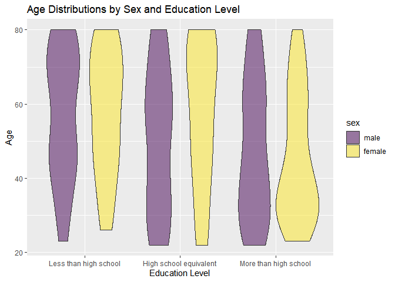
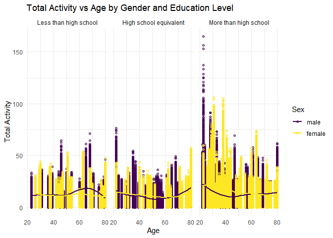
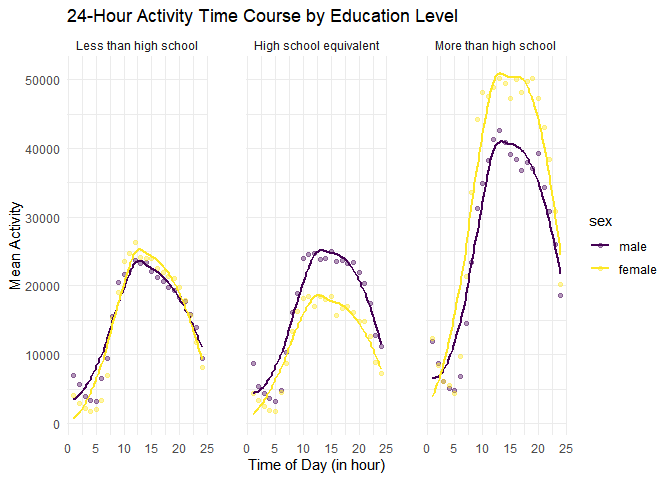

p8105_hw3_yy3564
================
Yonghao YU
2024-10-08

# Problem 2

``` r
library(tidyverse)
```

``` r
demographic = 
  read_csv("data/nhanes_covar.csv", skip = 4, na = c("NA","",".")) |>
  janitor::clean_names() |>
  drop_na(sex:education) |>
  filter(age>21) |>
  mutate(education = factor(education, levels = c("1", "2", "3"), labels = c("Less than high school", "High school equivalent", "More than high school"), ordered = TRUE)) |>
  mutate(sex = factor(sex, levels=c("1", "2"), labels = c("male", "female"), ordered = TRUE))
```

    ## Rows: 250 Columns: 5
    ## ── Column specification ────────────────────────────────────────────────────────
    ## Delimiter: ","
    ## dbl (5): SEQN, sex, age, BMI, education
    ## 
    ## ℹ Use `spec()` to retrieve the full column specification for this data.
    ## ℹ Specify the column types or set `show_col_types = FALSE` to quiet this message.

``` r
demographic
```

    ## # A tibble: 225 × 5
    ##     seqn sex      age   bmi education             
    ##    <dbl> <ord>  <dbl> <dbl> <ord>                 
    ##  1 62161 male      22  23.3 High school equivalent
    ##  2 62164 female    44  23.2 More than high school 
    ##  3 62174 male      80  33.9 More than high school 
    ##  4 62177 male      51  20.1 High school equivalent
    ##  5 62178 male      80  28.5 High school equivalent
    ##  6 62180 male      35  27.9 More than high school 
    ##  7 62184 male      26  22.1 High school equivalent
    ##  8 62189 female    30  22.4 More than high school 
    ##  9 62199 male      57  28   More than high school 
    ## 10 62202 male      36  24.7 Less than high school 
    ## # ℹ 215 more rows

``` r
accelerometer = 
  read_csv("data/nhanes_accel.csv", na = c("NA","",".")) |>
  janitor::clean_names() |>
  drop_na()|>
  pivot_longer(min1:min1440, names_to = "minute", values_to = "mims_value")
```

    ## Rows: 250 Columns: 1441
    ## ── Column specification ────────────────────────────────────────────────────────
    ## Delimiter: ","
    ## dbl (1441): SEQN, min1, min2, min3, min4, min5, min6, min7, min8, min9, min1...
    ## 
    ## ℹ Use `spec()` to retrieve the full column specification for this data.
    ## ℹ Specify the column types or set `show_col_types = FALSE` to quiet this message.

``` r
accelerometer
```

    ## # A tibble: 360,000 × 3
    ##     seqn minute mims_value
    ##    <dbl> <chr>       <dbl>
    ##  1 62161 min1        1.11 
    ##  2 62161 min2        3.12 
    ##  3 62161 min3        1.47 
    ##  4 62161 min4        0.938
    ##  5 62161 min5        1.60 
    ##  6 62161 min6        0.145
    ##  7 62161 min7        2.10 
    ##  8 62161 min8        0.509
    ##  9 62161 min9        1.63 
    ## 10 62161 min10       1.20 
    ## # ℹ 359,990 more rows

``` r
final_df = full_join(demographic,accelerometer) |>
  drop_na() |>
  mutate(minute = str_remove(minute, "[^0-9]+"))
```

    ## Joining with `by = join_by(seqn)`

``` r
final_df
```

    ## # A tibble: 324,000 × 7
    ##     seqn sex     age   bmi education              minute mims_value
    ##    <dbl> <ord> <dbl> <dbl> <ord>                  <chr>       <dbl>
    ##  1 62161 male     22  23.3 High school equivalent 1           1.11 
    ##  2 62161 male     22  23.3 High school equivalent 2           3.12 
    ##  3 62161 male     22  23.3 High school equivalent 3           1.47 
    ##  4 62161 male     22  23.3 High school equivalent 4           0.938
    ##  5 62161 male     22  23.3 High school equivalent 5           1.60 
    ##  6 62161 male     22  23.3 High school equivalent 6           0.145
    ##  7 62161 male     22  23.3 High school equivalent 7           2.10 
    ##  8 62161 male     22  23.3 High school equivalent 8           0.509
    ##  9 62161 male     22  23.3 High school equivalent 9           1.63 
    ## 10 62161 male     22  23.3 High school equivalent 10          1.20 
    ## # ℹ 323,990 more rows

``` r
demographic |>
  group_by(sex,education) |>
  summarise(num_obs=n())
```

    ## `summarise()` has grouped output by 'sex'. You can override using the `.groups`
    ## argument.

    ## # A tibble: 6 × 3
    ## # Groups:   sex [2]
    ##   sex    education              num_obs
    ##   <ord>  <ord>                    <int>
    ## 1 male   Less than high school       27
    ## 2 male   High school equivalent      34
    ## 3 male   More than high school       54
    ## 4 female Less than high school       28
    ## 5 female High school equivalent      23
    ## 6 female More than high school       59

``` r
ggplot(demographic,aes(x = education, y = age)) +
  geom_violin(aes(fill = sex), alpha = 0.5) +
  labs(title = "Age Distributions by Sex and Education Level",
       x = "Education Level",
       y = "Age")
```

<!-- -->

``` r
activity_df = final_df |>
  group_by(sex,minute,education,age) |>
  summarise(total_value = sum(mims_value, na.rm = TRUE))
```

    ## `summarise()` has grouped output by 'sex', 'minute', 'education'. You can
    ## override using the `.groups` argument.

``` r
activity_df
```

    ## # A tibble: 218,880 × 5
    ## # Groups:   sex, minute, education [8,640]
    ##    sex   minute education               age total_value
    ##    <ord> <chr>  <ord>                 <dbl>       <dbl>
    ##  1 male  1      Less than high school    23        4.01
    ##  2 male  1      Less than high school    29       12.4 
    ##  3 male  1      Less than high school    31        8.58
    ##  4 male  1      Less than high school    36        3.68
    ##  5 male  1      Less than high school    39        6.32
    ##  6 male  1      Less than high school    44        1.54
    ##  7 male  1      Less than high school    45        8.39
    ##  8 male  1      Less than high school    46        5.05
    ##  9 male  1      Less than high school    47        1.83
    ## 10 male  1      Less than high school    48        2.85
    ## # ℹ 218,870 more rows

``` r
ggplot(activity_df, aes(x = age, y = total_value, color = sex)) +
  geom_point(alpha = 0.5) +  # Add scatter points with transparency
  geom_smooth(method = "loess", se = FALSE) +  # Add a smooth trend line (using LOESS)
  facet_grid(~ education) +  # Separate panels by education level
  labs(title = "Total Activity vs Age by Gender and Education Level",
       x = "Age",
       y = "Total Activity",
       color = "Sex") +  # Label axes and color legend
  theme_minimal()  # Use a minimal theme for a clean look
```

    ## `geom_smooth()` using formula = 'y ~ x'

<!-- -->

``` r
activity_df2 = final_df |>
  mutate(minute = as.numeric(minute)) |>
  mutate(hour = floor((minute - 1) / 60) + 1) |>
  group_by(education,sex, hour)|>
  summarise(total_value = sum(mims_value, na.rm = TRUE))
```

    ## `summarise()` has grouped output by 'education', 'sex'. You can override using
    ## the `.groups` argument.

``` r
activity_df2
```

    ## # A tibble: 144 × 4
    ## # Groups:   education, sex [6]
    ##    education             sex    hour total_value
    ##    <ord>                 <ord> <dbl>       <dbl>
    ##  1 Less than high school male      1       6956.
    ##  2 Less than high school male      2       5594.
    ##  3 Less than high school male      3       3983.
    ##  4 Less than high school male      4       3356.
    ##  5 Less than high school male      5       3136.
    ##  6 Less than high school male      6       6521.
    ##  7 Less than high school male      7       9447.
    ##  8 Less than high school male      8      15540.
    ##  9 Less than high school male      9      20455.
    ## 10 Less than high school male     10      21702.
    ## # ℹ 134 more rows

``` r
ggplot(activity_df2, aes(x = hour, y = total_value, color = sex)) +
  geom_point(alpha = .4) +  # Add lines for activity over time
  geom_smooth(method = "loess", se = FALSE) +  # Add smooth trends with loess
  facet_grid(~ education) +  # Create separate panels for each education level
  labs(title = "24-Hour Activity Time Course by Education Level",
       x = "Time of Day (in hour)",
       y = "Mean Activity",
       color = "sex") +  # Label axes and legend
  theme_minimal() +  # Use a minimal theme for a clean plot
  theme(panel.spacing = unit(2, "lines"))
```

    ## `geom_smooth()` using formula = 'y ~ x'

<!-- -->
